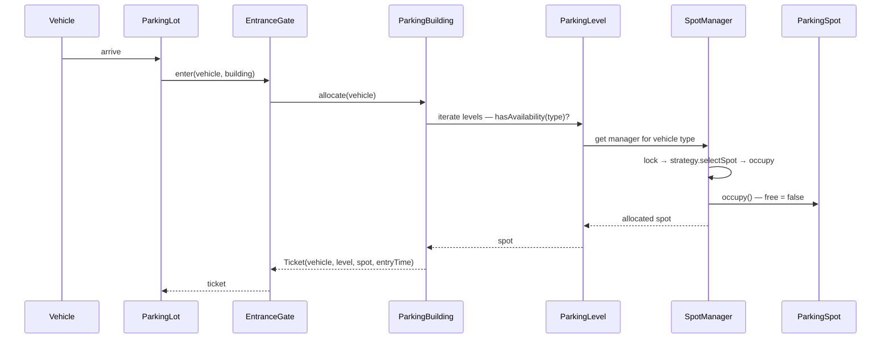
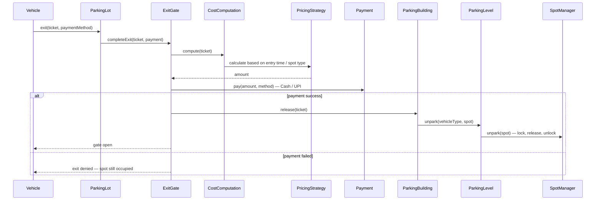

# Parking Lot — Low Level Design Guide

> Interview-focused LLD walkthrough: clarify requirements → derive flow → identify objects → build bottom-up → apply patterns.

This document captures the **multi-level parking lot design** with **per-level spot managers**, **fine-grained locking**, and **strategy-based** spot lookup & pricing — the approach commonly taught for LLD interviews.

Your runnable project in this folder (`parking-lot-lld`) implements a **similar but simplified** version. See [Mapping to this repo](#mapping-to-this-repo) at the end.

---

## Table of contents

1. [Interview approach](#1-interview-approach)
2. [Clarify requirements first](#2-clarify-requirements-first)
3. [Physical model](#3-physical-model)
4. [Entry & exit flow](#4-entry--exit-flow)
5. [Objects at first glance](#5-objects-at-first-glance)
6. [Class-by-class design (bottom → top)](#6-class-by-class-design-bottom--top)
7. [Design patterns used](#7-design-patterns-used)
8. [Concurrency model](#8-concurrency-model)
9. [Demo setup walkthrough](#9-demo-setup-walkthrough)
10. [Functional vs non-functional requirements](#10-functional-vs-non-functional-requirements)
11. [Common interview follow-ups](#11-common-interview-follow-ups)
12. [Mapping to this repo](#12-mapping-to-this-repo)

---

## 1. Interview approach

When the interviewer says **“Design a parking lot”**:

1. **Do not jump to code.** Clarify scope with the interviewer.
2. **Describe your mental picture** of a parking lot (gates, building, levels, spots).
3. **Walk through the flow** (vehicle enters → parks → exits → pays).
4. **Extract nouns from the flow** → those become classes.
5. **Build bottom-up**: `ParkingSpot` → managers → level → building → gates → lot.
6. **Call out patterns** as you go (Strategy, optional Factory for payment/vehicle).

> Every engineer has a different mental model. The goal is that **you and the interviewer agree on the same picture** before writing classes.

---

## 2. Clarify requirements first

Ask these upfront:

| Question | Default assumption |
|----------|-------------------|
| Single lot or multiple? | **One parking lot** |
| Multiple floors/levels? | **Yes** (can collapse to 1 level = ground only) |
| Vehicle types? | Two-wheeler, four-wheeler, truck, EV, cycle |
| Multiple entry/exit gates? | **Yes** — design supports list; demo uses one each |
| Payment at exit? | **Yes** — fixed or hourly pricing |
| Concurrency? | **Yes** — multiple vehicles at gates simultaneously |
| Display board / admin? | Optional extension |

**Scope tip:** If there is no “building”, treat it as a building with **one level**.

---

## 3. Physical model

```
ParkingLot
├── EntryGate(s)          ← vehicles arrive here
├── ExitGate(s)           ← vehicles leave here
└── ParkingBuilding
    ├── Level 1
    │   ├── TwoWheelerSpotManager   → [L1-S1, L1-S2, ...]
    │   └── FourWheelerSpotManager  → [L1-S3, ...]
    ├── Level 2
    │   ├── TwoWheelerSpotManager   → [L2-S1, ...]
    │   └── FourWheelerSpotManager  → [L2-S2, L2-S3, ...]
    └── Level N ...
```

**Key design choices:**

- **Level owns managers** — not one global two-wheeler list for the whole lot.
- **Each level has its own manager instances** — Level 1’s `TwoWheelerSpotManager` ≠ Level 2’s.
- **Spot is a dumb POJO** — only `spotId` + free/occupied; level lives in the hierarchy above.
- **Ground-only lot** = building with a single level.

---

## 4. Entry & exit flow

### Entry flow



**Steps in plain English:**

1. Vehicle arrives at **EntranceGate**.
2. Gate delegates to **ParkingBuilding.allocate(vehicle)** — gate does not pick the level.
3. Building iterates levels (strategy for *which level* can be added later).
4. First level with availability calls **level.park(vehicleType)**.
5. Level picks the right **SpotManager** from its map (`VehicleType → Manager`).
6. Manager: **lock** → **lookup strategy** picks free spot → **occupy** → **unlock**.
7. Building creates **Ticket** (vehicle number, level, spot id, entry time) and returns it.

### Exit flow



**Three steps at exit gate:**

1. **Cost computation** — `PricingStrategy` (fixed ₹100 vs hourly).
2. **Payment** — Cash / UPI (can be strategy pattern).
3. **Release spot** — only after successful payment → `building.release(ticket)`.

---

## 5. Objects at first glance

While narrating the flow, highlight these entities:

| Object | Role |
|--------|------|
| `Vehicle` | License number + vehicle type |
| `ParkingSpot` | One physical slot — id + free/occupied |
| `ParkingSpotManager` | Manages spots of one type on one level |
| `ParkingSpotLookupStrategy` | How to pick a free spot from a list |
| `ParkingLevel` | One floor — map of vehicle type → manager |
| `ParkingBuilding` | All levels — allocate / release |
| `EntranceGate` | Delegates entry to building |
| `ExitGate` | Price → pay → release |
| `Ticket` | Binds vehicle + level + spot + entry time |
| `CostComputation` | Uses pricing strategy |
| `Payment` | Payment method + status |
| `ParkingLot` | Owns building + gates — orchestrates arrive/exit |

**Object test:** Does it have **properties** (state) and **behavior** (methods)? → candidate for a class.

---

## 6. Class-by-class design (bottom → top)

### 6.1 Vehicle

```text
Vehicle
├── vehicleNumber: String
└── vehicleType: VehicleType   (TWO_WHEELER, FOUR_WHEELER, EV, TRUCK, ...)
```

Minimal POJO with getters/setters.

---

### 6.2 ParkingSpot (dumb POJO)

Intentionally **not intelligent** — no level reference here (level is modeled by parent hierarchy).

```text
ParkingSpot
├── spotId: String
├── isFree: boolean
├── occupy()      → isFree = false
├── release()     → isFree = true
└── isFree()      → return isFree
```

**Alternative design:** Some engineers put `level` on the spot. Both are valid — explain your choice to the interviewer.

---

### 6.3 ParkingSpotManager (abstract)

**Why separate managers per vehicle type?**

1. Each manager maintains **its own list** of spots.
2. Each can use a **different lookup strategy** (random vs fill ground first).
3. Each has **its own lock** — two-wheeler booking does not block four-wheeler booking.

```text
ParkingSpotManager (abstract)
├── spots: List<ParkingSpot>
├── lookupStrategy: ParkingSpotLookupStrategy
├── lock: Object
├── park()    → lock → strategy.select(spots) → occupy → unlock → return spot
├── unpark(spot) → lock → spot.release() → unlock
└── hasFreeSpot() → strategy can find free spot?

TwoWheelerSpotManager extends ParkingSpotManager
FourWheelerSpotManager extends ParkingSpotManager
EvSpotManager extends ParkingSpotManager
```

**Anti-pattern avoided:** One list of 100 mixed spots + one global lock → entire lot blocked for one two-wheeler.

---

### 6.4 ParkingSpotLookupStrategy (Strategy pattern)

```text
ParkingSpotLookupStrategy
└── selectSpot(spots: List<ParkingSpot>): ParkingSpot

RandomLookupStrategy        → first free spot found while iterating
NearestToEntranceStrategy   → extension
FillTopLevelFirstStrategy   → extension (used at building/level selection)
```

Each **SpotManager** can plug in its own strategy independently.

---

### 6.5 ParkingLevel

Each level maintains **its own map** of managers — **not shared** across levels.

```text
ParkingLevel
├── levelNumber: int
├── managers: Map<VehicleType, ParkingSpotManager>
│
├── hasAvailability(vehicleType): boolean
├── park(vehicleType): ParkingSpot
└── unpark(vehicleType, spot): void
```

**Example:**

| Level | Managers |
|-------|----------|
| Level 1 | TWO_WHEELER → TwoWheelerSpotManager, FOUR_WHEELER → FourWheelerSpotManager |
| Level 2 | FOUR_WHEELER → FourWheelerSpotManager, EV → EvSpotManager |

Level 1’s `TwoWheelerSpotManager` instance **≠** Level 2’s — they manage different spot lists.

---

### 6.6 ParkingBuilding

```text
ParkingBuilding
├── levels: List<ParkingLevel>
│
├── allocate(vehicle): Ticket
│   → for each level (or level-selection strategy):
│       if level.hasAvailability(vehicle.type):
│           spot = level.park(vehicle.type)
│           return new Ticket(vehicle, level, spot, now)
│   → throw ParkingFullException
│
└── release(ticket): void
    → level = ticket.level
    → level.unpark(ticket.vehicleType, ticket.spot)
```

**Level selection:** Demo iterates level 1, then 2, then 3. **Extension:** `LevelSelectionStrategy` (fill ground first, fill top first).

**Ticket creation:** Can live in building (has vehicle + level + spot) or at entrance gate — both are acceptable; justify your choice.

---

### 6.7 EntranceGate

```text
EntranceGate
└── enter(building, vehicle): Ticket
    → return building.allocate(vehicle)
```

- Gate **does not know** which level to use.
- Cannot exist without `ParkingLot` (composition).
- Multiple gates = `List<EntranceGate>` on `ParkingLot`.

---

### 6.8 ExitGate

```text
ExitGate
├── pricingStrategy: PricingStrategy
├── costComputation: CostComputation
│
└── completeExit(building, ticket, paymentMethod): boolean
    1. amount = costComputation.compute(ticket)
    2. success = payment.pay(amount, paymentMethod)
    3. if success → building.release(ticket) → gate open
       else → exit denied, spot stays occupied
```

---

### 6.9 Ticket

```text
Ticket
├── vehicleNumber: String
├── level: ParkingLevel (or levelNumber)
├── spot: ParkingSpot (or spotId)
└── entryTime: LocalDateTime
```

Binds **which vehicle** is on **which level** and **which spot** since **when**.

---

### 6.10 PricingStrategy (Strategy pattern)

```text
PricingStrategy
└── calculate(ticket): double

FixedPricingStrategy    → always ₹100
HourlyPricingStrategy   → ₹30 first 2 hours, ₹50 after
```

Spot type can influence price (premium EV, large vehicle) — pass ticket details into strategy.

---

### 6.11 Payment (Strategy pattern — optional)

```text
PaymentStrategy
└── pay(amount): boolean

CashPaymentStrategy
UpiPaymentStrategy
```

---

### 6.12 ParkingLot (top-level orchestrator)

```text
ParkingLot
├── building: ParkingBuilding
├── entranceGates: List<EntranceGate>   (demo: one)
├── exitGates: List<ExitGate>           (demo: one)
│
├── vehicleArrive(vehicle, gate?): Ticket
│   → entranceGate.enter(building, vehicle)
│
└── vehicleExit(ticket, paymentMethod, gate?): void
    → exitGate.completeExit(building, ticket, paymentMethod)
```

---

## 7. Design patterns used

| Pattern | Where | Why |
|---------|-------|-----|
| **Strategy** | `ParkingSpotLookupStrategy` | Random vs nearest vs level-priority spot pick |
| **Strategy** | `PricingStrategy` | Fixed vs hourly vs tiered pricing |
| **Strategy** | `PaymentStrategy` | Cash vs UPI |
| **Strategy** (future) | `LevelSelectionStrategy` | Which level to try first |
| **Template method** (optional) | `ParkingSpotManager.park()` | Lock → select → occupy → unlock skeleton |
| **Composition** | `ParkingLot` has building + gates | Gates delegate; lot orchestrates |

---

## 8. Concurrency model

### Problem

Two two-wheelers at the same gate must **not** book the same spot.

### Naive approach (bad)

```text
Single List<ParkingSpot> all 100 spots + one global lock
→ any park/unpark blocks entire lot
```

### This design (good)

```text
Level 1 TwoWheelerManager.lock   → only blocks Level 1 two-wheeler spots
Level 1 FourWheelerManager.lock  → independent — can run in parallel
Level 2 TwoWheelerManager.lock     → independent — different level
```

**Lock scope:** Only during **select + occupy** (or **release**) — short critical section.

**Parallel scenarios that work:**

- Two-wheeler on Level 1 + four-wheeler on Level 1 → parallel (different managers).
- Two-wheeler on Level 1 + two-wheeler on Level 2 → parallel (different level managers).
- Two two-wheelers on Level 1 → serialized by Level 1 TwoWheelerManager lock (correct).

---

## 9. Demo setup walkthrough

### Level 1

| Spot ID | Manager |
|---------|---------|
| L1-S1 | TwoWheelerSpotManager |
| L1-S2 | TwoWheelerSpotManager |
| L1-S3 | FourWheelerSpotManager |

### Level 2

| Spot ID | Manager |
|---------|---------|
| L2-S1 | TwoWheelerSpotManager |
| L2-S2 | FourWheelerSpotManager |
| L2-S3 | FourWheelerSpotManager |

### Wiring

```text
building = ParkingBuilding([level1, level2])
parkingLot = ParkingLot(building, entranceGate, exitGate)
exitGate uses FixedPricingStrategy
all managers use RandomLookupStrategy
```

### Sample run

```text
vehicleArrive(bike 101)   → Ticket: Level 1, L1-S1
vehicleArrive(car 201)    → Ticket: Level 1, L1-S3
vehicleExit(ticket1, CASH) → ₹100, spot released, gate open
vehicleExit(ticket2, UPI)  → ₹100, spot released, gate open
```

---

## 10. Functional vs non-functional requirements

### Functional (what the system does)

- Park vehicle and assign compatible spot
- Issue ticket with vehicle, level, spot, entry time
- Reject when full
- Compute fee at exit (by time and/or spot type)
- Process payment before release
- Free spot after successful payment
- Support multiple vehicle types and levels
- Support multiple entry/exit gates (extensible)

### Non-functional (how well it works)

| NFR | How this design addresses it |
|-----|------------------------------|
| **Concurrency** | Per-manager locks; level-level parallelism |
| **Extensibility** | Strategy for lookup, pricing, payment, level selection |
| **Maintainability** | Clear delegation: Gate → Building → Level → Manager → Spot |
| **Scalability** | Add levels/managers/spots without changing gate code |
| **Consistency** | Ticket ties vehicle to spot; release only after payment |
| **Flexibility** | Ground-only = single level; no schema change |

---

## 11. Common interview follow-ups

**Q: Why not Singleton for ParkingLot?**  
Both work. Singleton emphasizes one lot instance; composition with explicit `ParkingLot` is clearer for testing.

**Q: Where would you persist tickets?**  
Production: DB or Redis. LLD: in-memory map on building or lot.

**Q: How handle lost ticket?**  
Lookup by license plate in active tickets map.

**Q: How add a new vehicle type (EV)?**  
Add `EvSpotManager`, register on relevant levels — no gate changes.

**Q: How test concurrency?**  
Multi-threaded integration test: N threads park on same level/type; assert no duplicate spot assignment.

**Q: Difference between your design and a single `ParkingLot` class doing everything?**  
Separation of concerns + finer locks + easier to extend strategies.

---

## 12. Mapping to this repo

This folder contains a **runnable simplified version** you can compile and demo:

```bash
cd com.harshit/parking-lot-lld
mvn compile exec:java
```

| Video / interview design | This repo (`parking-lot-lld`) |
|--------------------------|-------------------------------|
| `ParkingBuilding` + `ParkingLevel` | `ParkingLot` + `ParkingFloor` |
| `TwoWheelerSpotManager`, `FourWheelerSpotManager` | Single `SpotAssignmentStrategy` on lot |
| Per-manager lock | `synchronized` on `ParkingLot.parkVehicle()` + spot methods |
| `EntranceGate` / `ExitGate` | `EntryGate` / `ExitGate` ✅ |
| `PricingStrategy` | `FlatPricingStrategy`, `HourlyPricingStrategy` ✅ |
| `ParkingSpotLookupStrategy` | `FirstAvailableSpotAssignmentStrategy` |
| Observer / display board | `DisplayBoard`, `ParkingObserver` ✅ |
| `VehicleFactory` | `VehicleFactory` ✅ |

**Concepts are the same** — this repo trades the full manager hierarchy for a smaller codebase that still demonstrates **Strategy**, **Factory**, **Observer**, **Singleton**, and **gate delegation**.

To practice the **full interview design**, implement the manager-per-type-per-level model as a second package (e.g. `com.harshit.parkinglot.multilevel`).

---

## Quick whiteboard checklist

Before you leave the interview room, you should have drawn:

- [ ] Parking lot structure (gates → building → levels → managers → spots)
- [ ] Entry sequence (allocate → park → ticket)
- [ ] Exit sequence (price → pay → release)
- [ ] At least two Strategy interfaces (lookup + pricing)
- [ ] Where locks live and why not one global lock
- [ ] Ticket fields

---

## One-minute summary script

> “I start by clarifying multi-level parking with multiple gates and vehicle types. Spots are dumb POJOs. Each level has its own spot managers per vehicle type, each with its own list, lookup strategy, and lock — so concurrency is fine-grained. Entrance gate delegates to the building, which picks a level, then level picks manager, manager locks and assigns a spot, and building returns a ticket. Exit gate computes price via strategy, processes payment, then building releases the spot through the same level → manager chain. The design extends to more gates, levels, and strategies without rewriting gates.”

---

*Happy interviewing — run the demo, sketch the diagram, explain the flow aloud.*
